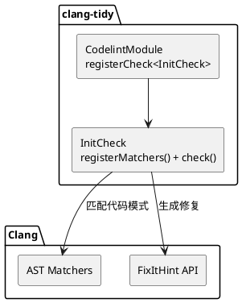

# Codelint — C++ 初始化检查工具

> **基于 LLVM/Clang 的 clang-tidy 插件，提供 C++ 初始化问题的自动修复能力**

---

## 目录

1. [简介](#一简介)
2. [当前功能](#二当前功能)
3. [技术架构](#三技术架构)
4. [未来方向](#四未来方向)
5. [快速上手](#五快速上手)

---

## 一、简介

### 1.1 定位

**Codelint** 是一款基于 LLVM/Clang 的 clang-tidy 插件，用于检测 C++ 代码中的初始化问题并提供自动修复。

与其他 lint 工具不同，Codelint 的重点是**自动修复**——大多数检测到的问题可以通过 `--fix` 一键修复，无需手动修改。

### 1.2 主要特性

| 特性 | 说明 |
|------|------|
| **自动修复** | 80%+ 检测到的问题可自动修复 |
| **AST 级分析** | 基于 Clang AST，非文本匹配 |
| **智能跳过** | 内置跳过列表，避免误报 |
| **本地运行** | 无需联网，无数据外泄 |

### 1.3 技术栈

- **基础架构**: LLVM 21 + Clang-tidy 插件
- **语言标准**: C++20
- **分析方式**: Clang AST Matchers

### 1.4 示例

```cpp
// 未初始化变量
int count;
process(count);  // 未定义行为

// Codelint 修复后
int count{};
```

```cpp
// 等号初始化
int x = 5;

// Codelint 修复为 brace init
int x{5};
```

```cpp
// 危险类型转换（需手动修复）
bool success = Init();  // int → bool

// Codelint 报告 Error，由开发者决定如何修复
bool success{true};
```

---

## 二、当前功能

### 2.1 检查器：codelint-init

`codelint-init` 是 Codelint 的主要检查器，用于检测和修复 C++ 变量初始化问题，推广使用 brace initialization (`{}`)。

#### Brace Init 的优势

| 特性 | 传统 `=` 初始化 | Brace Init `{}` |
|------|----------------|-----------------|
| Narrowing 检查 | 允许，运行时截断 | 编译期阻止 |
| 语法统一 | 不同类型不同语法 | 所有类型统一 |
| 防止 vexing parse | `A a();` 被解析为函数 | `A a{};` 明确为对象 |
| 默认初始化 | 内置类型不初始化 | `{}` 零初始化 |

#### 自动修复能力

| 问题类型 | 修复前 | 修复后 | 修复方式 |
|----------|--------|--------|----------|
| 未初始化变量 | `int x;` | `int x{}` | 自动 |
| 等号初始化 | `int x = 5;` | `int x{5};` | 自动 |
| 字符串初始化 | `std::string s = "hi";` | `std::string s{"hi"};` | 自动 |
| 缺少 U 后缀 | `unsigned u = 100;` | `unsigned u{100U};` | 自动 |
| 危险布尔转换 | `bool ret = Init();` | — | Error 警告 |

#### 跳过列表

以下场景会被自动跳过，不会产生误报：

| 场景 | 示例 | 原因 |
|------|------|------|
| For 循环 | `for (int i = 0; i < n; i++)` | C 习惯用法 |
| Catch 参数 | `catch (const Exception& e)` | 异常参数由 catch 初始化 |
| 宏定义 | `#define MACRO() { int x = 1; }` | 宏内无法安全修改 |
| Auto 类型 | `auto x = getValue()` | 类型推导需要初始化表达式 |
| Extern 声明 | `extern int x;` | 定义在其他翻译单元 |
| Union 成员 | `union { int a; float b; }` | Union 特殊语义 |
| Bitfields | `int flags : 4;` | 位域特殊语法 |
| 引用 | `int& ref = x;` | 引用必须绑定到已有对象 |
| 默认参数 | `void foo(int a = 10)` | 函数签名的一部分 |
| Lambda 捕获 | `[](int x) { ... }` | Lambda 参数上下文 |
| 已 Brace 初始化 | `int x = {};` | 已经是 brace init |
| Narrowing | `int x = 3.14;` | 仅警告，不修改 |
| 类型拓宽 | `float f = 5;` | 安全的隐式转换 |

#### initializer_list 处理

```cpp
class MyArray {
public:
  MyArray(std::initializer_list<int> list);
  MyArray(int value);
};

MyArray arr = 1;   // 跳过 - 改为{1}会调用 initializer_list 构造函数
MyArray arr2{10};  // 正确

std::string s = "hello";  // 修复为 std::string s{"hello"}
// std::string 有 initializer_list<char>，但"hello"是 const char*
```

#### 类成员初始化检查

```cpp
class Widget {
  int id;
  std::string name;

  Widget() {}           // 警告：成员未初始化
  Widget() : id{}, name{} {}  // 正确
};
```

#### 类成员初始化检查

```cpp
class Widget {
  int id;
  std::string name;

  Widget() {}           // 警告：成员未初始化
  Widget() : id{}, name{} {}  // 正确
};
```

---

## 三、技术架构

### 3.1 架构



### 3.2 工作流程

1. Clang 解析源码生成 AST
2. AST Matchers 匹配代码模式
3. `InitCheck::check()` 生成诊断和 FixItHint
4. `--fix` 应用自动修复

### 3.3 扩展新检查器

```cpp
// 1. 创建头文件
class MyCheck : public ClangTidyCheck {
public:
  void registerMatchers(MatchFinder* Finder) override;
  void check(const MatchFinder::MatchResult& Result) override;
};

// 2. 实现 matcher
Finder->addMatcher(varDecl().bind("var"), this);

// 3. 注册
CheckFactories.registerCheck<MyCheck>("codelint-mycheck");
```

---

## 四、未来方向

### 4.1 代码库级批量修复

**目标**：支持大规模代码库的自动化整改

```bash
# 扫描
codelint-scan --project=src/ --output=report.json

# 批量修复
codelint-fix --check=codelint-init --scope=all
```

### 4.2 自定义规则

**目标**：支持通过配置定义新规则

```yaml
# rule.yaml
name: "no-raw-pointer"
matcher: "varDecl(hasType(isPointerType()))"
message: "use smart pointer instead"
severity: warning
```

---

## 五、快速上手

### 5.1 环境要求

- LLVM/Clang 21
- CMake 3.20+
- C++20 编译器

### 5.2 编译

```bash
git clone https://github.com/arong/codelint.git
cd codelint

cmake -B build \
  -DLLVM_DIR=/opt/homebrew/opt/llvm@21/lib/cmake/llvm

cmake --build build
```

### 5.3 运行

```bash
clang-tidy \
  --load=build/lib/codelint-plugin.dylib \
  --checks=codelint-init \
  --fix \
  src/**/*.cpp
```

### 5.4 配置

```yaml
# .clang-tidy
---
Checks: 'codelint-init'
HeaderFilterRegex: '.*'
```

### 5.5 抑制特定警告

```cpp
int x;  // NOLINT(codelint-init)
```

---

## 附录

### A. FAQ

**Q: 会改变代码行为吗？**

A: 不会。所有自动修复都保持语义不变。

**Q: 如何禁用某些检查？**

A: 使用 `// NOLINT(codelint-init)` 或在 `.clang-tidy` 中配置 `Checks: '-codelint-init'`。

**Q: 支持 C 语言吗？**

A: 当前仅支持 C++。

### B. 参考资料

- [LLVM Documentation](https://llvm.org/docs/)
- [Clang-tidy Plugin Guide](https://clang.llvm.org/extra/clang-tidy/)

### C. 许可证

MIT License

---

版本：1.0
最后更新：2026-04-16
